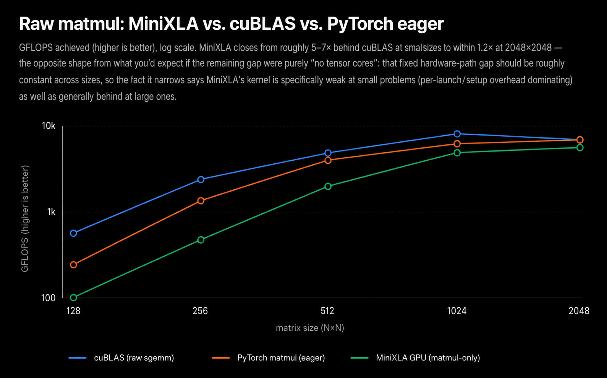
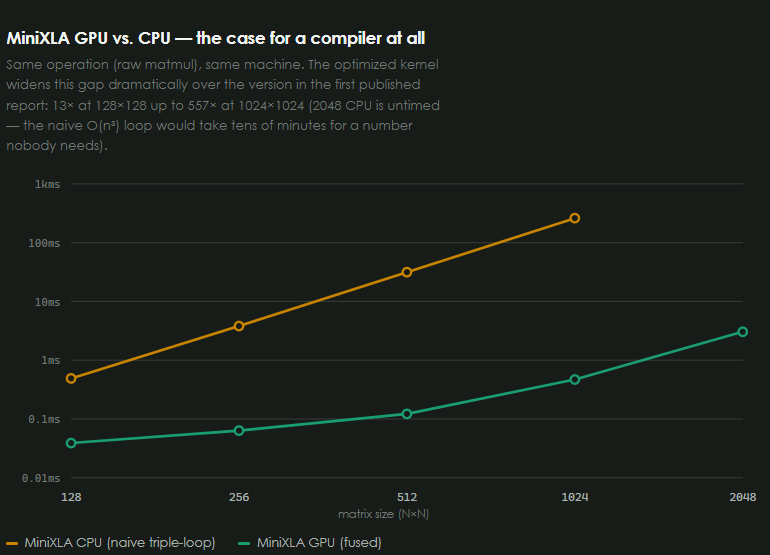

# MiniXLA

A small ML compiler in C: you build a tensor DAG, it optimizes the graph,
emits PTX for fused matmul kernels, and runs them on NVIDIA GPUs through the
CUDA Driver API.

This is a learning compiler, not a framework. The point is to see the path
from `matmul → add → relu` to a real kernel, including the bugs that only
show up on DAGs (shared nodes, fused epilogues) rather than straight chains.
It started out not trying to beat PyTorch or XLA; a later session did try, honestly, on both
speed and memory. Measured kernel throughput vs cuBLAS is in
[the benchmark report](docs/bench_report.html), including where MiniXLA is far behind — and the
memory/latency-vs-PyTorch-eager results below, including the one place it's genuinely ahead.

The phase roadmap and unfinished ideas live in [`idea.md`](idea.md). This
README is what actually exists.

## Benchmarks

A hand-written PTX kernel, on an RTX 4060 Laptop GPU, measured process-isolated
against `cublasSgemm` and PyTorch eager, no cherry-picking, methodology in
full in [the report](docs/bench_report.html):

| Size | cuBLAS (GFLOPS) | PyTorch | MiniXLA GPU | % of cuBLAS |
|---|---:|---:|---:|---:|
| 128×128 | 582 | 256 (43.9%) | 108 | 18.5% |
| 256×256 | 2,523 | 1,491 (59.1%) | 537 | 21.3% |
| 512×512 | 5,046 | 4,372 (86.7%) | 2,222 | 44.0% |
| 1024×1024 | 8,052 | 6,337 (78.7%) | 5,256 | 65.3% |
| 2048×2048 | 6,940 | 6,910 (99.6%) | 5,849 | **84.3%** |




(The CPU number in that second chart is MiniXLA's own naive triple-loop matmul,
not a competing implementation. It exists as the correctness reference the
GPU kernel is checked against, not as something meant to be fast; the chart
is there to show why a compiler that emits real kernels is worth having at
all, not to claim a CPU win over anything.)

That 2048×2048 number was 12.9% of cuBLAS at the start of one session. Getting
it to 84.3% took two separate things, both written up honestly, mistakes
included: a [research pass](docs/research/gemm-optimization.md) that took the
kernel itself from a naive shared-memory tile to 2D register blocking +
vectorized SMEM reads (4.1× faster, run as an autonomous
[autoresearch](docs/research/autoresearch-gemm.md) loop: one hypothesis per
commit, correctness-gated against the CPU reference, kept or reverted, no
hand-holding), and finding a reproducible cross-process benchmarking bug
that had been *inflating* the measured gap the whole time. cuBLAS still wins
because it's routing through TF32 tensor cores on this GPU by default and
MiniXLA is still CUDA cores only. [siboehm's worklog](https://siboehm.com/articles/22/CUDA-MMM)
says 93.7% of cuBLAS is reachable on CUDA cores alone; that's the next lever,
not a wall.

A follow-up session pulled that lever: MiniXLA now has a second, additive GPU kernel path
using real TF32 tensor cores (`mma.sync.aligned.m16n8k8.row.col.f32.tf32.tf32.f32`), fragment
layout taken verbatim from the PTX ISA doc and correctness-verified against the CPU reference
across boundary-ragged shapes. Honest result: it's correct, but tops out at **51.4% of cuBLAS**
at 2048×2048 in that session's own fresh measurement (cuBLAS itself measured 7,622.9 GFLOPS
there, not the 6,940 above — this GPU's numbers vary meaningfully day to day, both are real) —
behind the existing CUDA-core kernel, not ahead of it. Full writeup, including two follow-up
tuning attempts that made it *slower* and why, in
[the tensor-core research doc](docs/research/tensorcore-and-fusion.md).

That same session asked a more honest question: raw GEMM GFLOPS is the hardest possible place
to beat a vendor BLAS, so where does this compiler's design actually have a structural edge?
Two answers, measured against PyTorch eager, process-isolated, same methodology as the table
above, for `relu(matmul(a,b)+c)`:

| Size | MiniXLA fused latency vs PyTorch eager | MiniXLA peak memory vs PyTorch |
|---|---|---|
| 128×128 | **21% faster** | **4.22× less** |
| 256×256 | 33% slower | **4.69× less** |
| 512×512 | 61% slower | **3.28× less** |
| 1024×1024 | 27% slower | **1.76× less** |
| 2048×2048 | 10% slower | **1.38× less** |

**Memory is a real, whole-range win**: one fused kernel launch materializes zero intermediate
tensors (3 separate full-size tensors in PyTorch eager, 0 in MiniXLA), so MiniXLA uses
meaningfully less GPU memory at every size tested. **Latency is not** — the launch-count
savings only outrun MiniXLA's slower per-FLOP kernel at the smallest size tested; PyTorch eager
wins everywhere else. Full numbers and analysis, including why `torch.compile` isn't in this
comparison (no working Triton on this Windows machine), in the same research doc.

## Pipeline

```
g_matmul / g_add / g_relu / …
        │
        ▼
   computational DAG
        │
        ▼
     optimize()          constant fold, drop redundant transposes,
        │                fuse matmul + elementwise into OP_FUSED
        ▼
     emit_ptx()          tiled shared-memory GEMM + fused epilogue
        │
        ▼
   gpu_execute()         CUDA Driver API, module cache, last-use free
```

CPU `execute()` runs the same optimized graph. It exists as a correctness
reference for the GPU path, not as a fast path in its own right; GPU results
are checked against it.

## Example

```c
Tensor* a = create_tensor((float[]){1, 2, 3, 4, 5, 6}, (int[]){2, 3}, 2);
Tensor* b = create_tensor((float[]){1, 2, 3, 4, 5, 6}, (int[]){3, 2}, 2);
Tensor* c = create_tensor((float[]){-100, 0, 0, -100}, (int[]){2, 2}, 2);

Node* root = g_relu(g_add(g_matmul(input_node(a), input_node(b)), input_node(c)));
root = optimize(root);              // OP_FUSED: matmul + add + relu

print_tensor(execute(root));        // CPU
// or: gpu_execute(root, gpu_ctx_create());
```

`main.c` is this program. Expected output: `[[0, 28], [49, 0]]`.

## What works

| Layer | Ops / behavior |
|---|---|
| Tensors | `matmul`, `add` (including trailing-suffix bias broadcast), `mul`, `relu`, `softmax`, `transpose`, `permute`. CPU matmul is batched. |
| Graph | `g_*` constructors, `input_node` / `const_node`, `execute`, `graph_collect` (reachability), `graph_topo_order` (dependency order). |
| Optimizer | Constant folding, redundant-op removal (`transpose(transpose(x))`), operator fusion into `OP_FUSED` with an epilogue. Runs to a fixpoint; orphans are freed after every pass. |
| PTX | 2-D register-blocked GEMM (`BM×BN` tile, `TM×TN` per thread) plus fused add/mul/relu epilogue. Arbitrary M/N/K via predicated boundary loads. Second, additive path: a real TF32 tensor-core kernel (`mma.sync`, shared-memory blocked) — correct, not yet faster; see [the research doc](docs/research/tensorcore-and-fusion.md). |
| GPU runtime | Full-DAG execution of fused kernels, intermediates stay on device, last-use buffer free, PTX module cache. |
| Autodiff | Reverse-mode `backward()` on the **unoptimized** graph. Gradients are tensors, not a second graph. Finite-difference checked. |

Constraints that have bitten real code (and have tests):

- GPU kernels are 2-D. There is no batch dimension in PTX.
- GPU `OP_ADD` epilogue operands must be full `M×N`. Broadcast bias-add is CPU-only; the GPU path refuses it rather than compute the wrong thing.
- `backward()` must run **before** `optimize()`. Fused nodes have no VJP.
- `graph_topo_order` is not “reverse of `graph_collect`”. Reversing preorder is only valid for a tree; a shared node feeding two branches is a different order. Both GPU scheduling and autodiff need the real topo order.

## Build

`gcc` for anything that never touches CUDA. `nvcc` + a CUDA GPU for the
runtime (`nvcc` uses MSVC as the host compiler on Windows and compiles this
C99 as-is). Benchmarks also want cuBLAS (CUDA toolkit) and, for the PyTorch
points, a Python env with `torch`.

```sh
# CPU demo
gcc -O2 -Wall -o demo main.c graph.c tensor.c optimizer.c -lm
./demo

# CPU tests: graph, optimizer, autodiff, ptxas-validated codegen
gcc -O2 -Wall -o tests tests.c graph.c tensor.c optimizer.c ptx.c autodiff.c -lm
./tests

# GPU tests: assemble PTX, run it, compare to CPU (1e-4 … 1e-2)
nvcc -o gpu_test gpu_test.c graph.c tensor.c optimizer.c ptx.c runtime.c gpu_exec.c -lcuda
./gpu_test

# Benchmarks vs cuBLAS, then vs PyTorch
nvcc -O2 -o bench bench.c graph.c tensor.c optimizer.c ptx.c gpu_exec.c -lcuda -lcublas
./bench
python bench_pytorch.py
```

18 CPU tests, 9 GPU tests (including a diamond DAG that caught two shipped
bugs chain-shaped tests missed, and two tensor-core correctness tests across
boundary-ragged shapes). Both suites should pass before a change to
`graph.c`, `optimizer.c`, `tensor.c`, `ptx.c`, `runtime.c`, or `gpu_exec.c`
is done: the two backends execute the same optimized graphs.

## Layout

| File | Role |
|---|---|
| `tensor.c` / `tensor.h` | CPU tensor ops and memory |
| `graph.c` / `graph.h` | DAG, execution, fused-node CPU executor |
| `optimizer.c` / `optimizer.h` | Passes + fixpoint manager |
| `ptx.c` / `ptx.h` | PTX emitter |
| `runtime.c` / `runtime.h` | Single fused kernel via CUDA Driver API |
| `gpu_exec.c` / `gpu_exec.h` | Full-graph GPU execution |
| `autodiff.c` / `autodiff.h` | Reverse-mode gradients |
| `main.c` | CPU demo |
| `tests.c` | CPU suite |
| `gpu_test.c` | GPU suite |
| `bench.c` / `bench_pytorch.py` | Numbers behind the report |

## Docs

- [`docs/bench_report.html`](docs/bench_report.html): measured vs cuBLAS and PyTorch
- [`docs/superpowers/specs/`](docs/superpowers/specs/): design notes per phase
- [`docs/research/gemm-optimization.md`](docs/research/gemm-optimization.md): kernel worklog (register blocking → vectorized loads → autotune → tensor cores)
- [`docs/research/tensorcore-and-fusion.md`](docs/research/tensorcore-and-fusion.md): TF32 tensor-core kernel (PTX ISA fragment layout, correctness gate, why it isn't faster yet) + the fused-latency/memory-vs-PyTorch results
- [`idea.md`](idea.md): original roadmap. Phase 8 (multi-GPU) is a design doc only: this machine has one GPU and no NCCL.

## Status

Phases 1–7 are implemented and hardware-checked. The current CUDA-core
emitter is a 2-D register-blocked GEMM; a second, additive TF32
tensor-core emitter exists alongside it (correctness-verified, not yet
faster — see the research doc above). Neither closes the gap to
cuBLAS/PyTorch on raw GEMM throughput. The place this compiler's design
does show a real, measured edge over PyTorch eager is memory (less peak
GPU memory at every size tested, from zero intermediate materialization)
and, narrowly, fused-call latency at the smallest size tested — not
GFLOPS. The remaining work is kernel performance and closing that
fusion-latency gap at larger sizes, not missing compiler stages.
